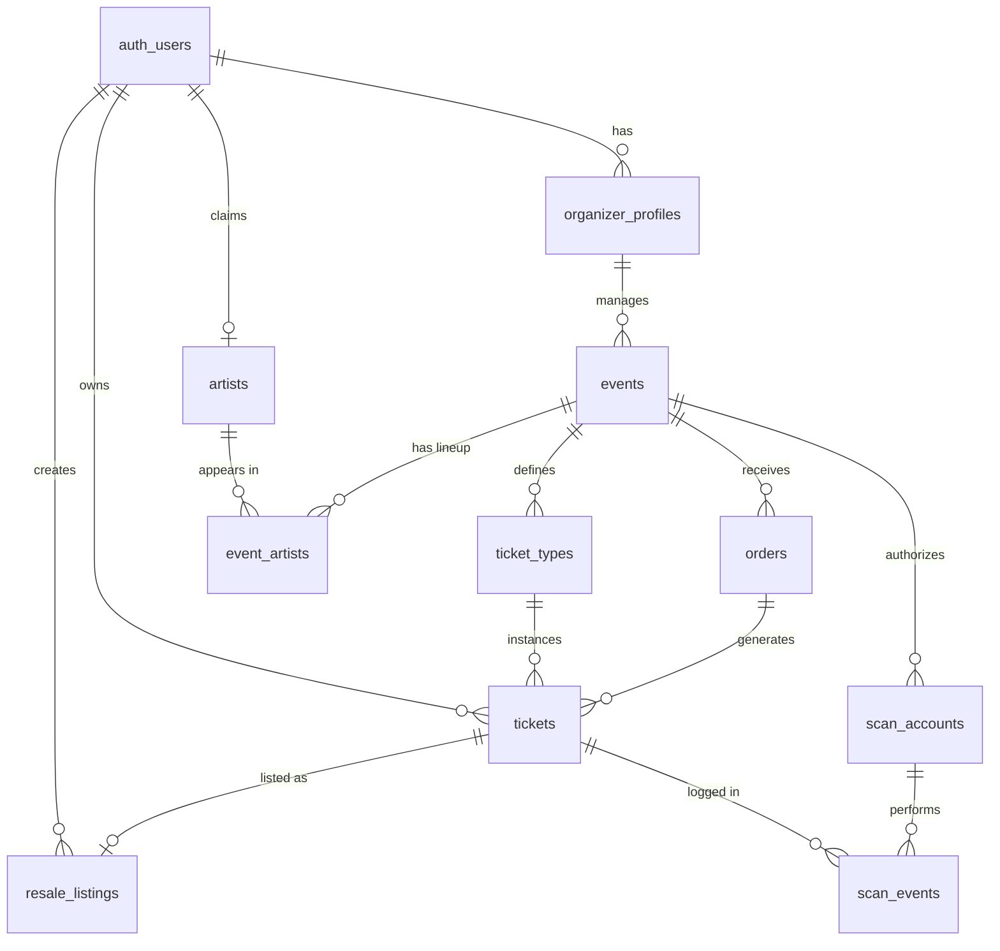

# ReactTicketing: Codebase Knowledge Document

## 1. High-Level Overview

### 1.1 Application Purpose and Domain
ReactTicketing is a comprehensive, multi-tenant ticketing platform designed to manage both primary market ticket sales and a secure secondary resale market. The platform serves multiple distinct user types:
* **Fans (Buyers):** Can discover events, purchase primary tickets, manage a digital wallet of tickets, and securely resell tickets to other fans.
* **Organizers:** Can create and publish events, manage ticket pricing tiers, customize their event's theme (via a Pro tier), manage an artist lineup, publish community blogs, and validate tickets via a dedicated mobile scanner.
* **Artists:** Can claim auto-generated profiles to self-manage their image, bio, and social links.
* **Admins & Superadmins:** Provide platform oversight, customer support (via an integrated ticket desk), review and approve Artist claim requests, and manage system-wide settings.

### 1.2 Tech Stack
* **Frontend / Web Platform:** React 19, React Router, Vite, Server-Side Rendering (SSR) via Express.
* **Mobile App:** Capacitor (wrapping a web view) for a dedicated ticket scanning app (`mobile-scanner`).
* **Backend & Database:** Supabase (PostgreSQL), utilizing heavily parameterized Row Level Security (RLS) and Postgres RPC functions for secure, atomic operations (e.g., ticket transfers).
* **Testing:** Playwright (E2E), Vitest (Unit/Component).

### 1.3 Architectural Structure
The repository is structured as a monorepo with the following primary modules:
* `/platform`: The core React web application, utilizing an SSR architecture.
* `/mobile-scanner`: A Capacitor-based wrapper for iOS/Android distribution of the ticket validation scanner.
* `/supabase`: Contains all database migrations, RPC functions, seed data, and configuration for the backend.
* `/reactticket` & `/reactticket-core`: Internal libraries/components likely used for rendering specific ticket interfaces.
* `/design` & `/docs`: Architecture, roadmap, and contributing documentation.
* `/codebase-analysis-docs`: Modular tracking and analytical documentation of the platform's systems.

---
*(End of Phase 1 - Initial Context Scan)*

## 2. System Architecture Deep Dive

### 2.1 Data Flow and Interactions
ReactTicketing heavily utilizes a **BaaS (Backend-as-a-Service) architecture** pattern with Supabase as the core data and authentication layer. 

**Client-to-Database Flow:**
1. **Frontend (React/Vite):** Client-side components use the `@supabase/supabase-js` client to query the database directly. 
2. **Authentication:** Uses Supabase Auth (`auth.users`) to manage sessions. Role claims are stored in a custom `user_roles` table.
3. **Database Security (RLS):** Row Level Security policies enforce access constraints directly at the Postgres layer. E.g., Fans can only `SELECT` tickets where `owner_id = auth.uid()`. Organizers can only `UPDATE` events where `organizer_id = auth.uid()`.
4. **RPC Functions:** Complex operations that require transactionality or bypassing RLS (e.g., executing a secondary market ticket transfer from Seller to Buyer) are encapsulated in PostgreSQL Functions (`buy_resale_ticket`) exposed via RPC.

### 2.2 Core Database Entities
- `events` & `ticket_types`: The primary models for the primary market.
- `tickets`: The core asset, linked to an `owner_id`.
- `resale_listings`: Secondary market listings linking a ticket to a seller and an asking price.
- `orders`: Records of purchase intent and finalization.
- `organizer_profiles`: Organizer metadata and subscription tiers.
- `artists` & `artist_claims` & `event_artists`: Artist directory, lineup mappings, and ownership claim workflow.
- `blogs`: Markdown-powered community posts.
- `support_tickets` & `support_ticket_messages`: Customer support infrastructure.
- `scan_accounts` & `scan_events`: Credentials and logs for the physical ticket validation layer.

### 2.3 Cross-Cutting Concerns
* **Security:** 
    * "God-mode" or cross-tenant functions (e.g., `promote_admin_by_email` or `buy_resale_ticket`) use `SECURITY DEFINER` with explicit `REVOKE EXECUTE FROM PUBLIC/anon` to prevent unauthenticated execution.
    * Database RLS ensures that frontend queries do not need complex filtering logic to remain secure.
* **Storage:** Supabase Storage is used for event images (`event_images` bucket), protected by public read policies and restricted write policies.
* **Theming:** Handled via a JSONB column `theme_customization` on the `events` table, allowing dynamic CSS injection for Pro-tier organizers.

---
*(End of Phase 2 - System Architecture Deep Dive)*

## 3. Feature-by-Feature Analysis

### 3.1 Public Marketplace & Ticketing
* **Purpose:** Allows fans to discover events and purchase primary market tickets.
* **Technical Breakdown:**
  * **Entry Points:** `platform/src/pages/marketplace/Home.tsx` (Feed), `EventDetails.tsx` (Event Page).
  * **Models:** `events`, `ticket_types`, `orders`, `tickets`.
  * **Execution:** Users select a ticket tier via `<PrimaryTicketSelector />`. The `CheckoutModal.tsx` simulates payment and inserts an `order` and `ticket` record.
* **Edge Cases & Nuances:** External events (`is_external: true`) bypass the checkout modal entirely and direct users to an `external_ticket_url`.

### 3.2 Secondary Resale Market
* **Purpose:** Enables secure, fraud-free peer-to-peer ticket resales.
* **Technical Breakdown:**
  * **Entry Points:** `platform/src/pages/marketplace/ResaleMarket.tsx` (Global feed), `platform/src/pages/fan/Wallet.tsx` (Listing interface).
  * **Models:** `resale_listings`, `tickets`.
  * **Execution:** Fans list a ticket for a specific `asking_price_cents`. Buyers trigger the `buy_resale_ticket` RPC function. This function atomically verifies the listing, transfers the `owner_id` on the `tickets` table to the buyer, deletes the `resale_listings` record, and completes the transaction safely.
* **Interactions:** A listed ticket is "Locked" in the user's `<TicketCard />` in the Wallet to prevent them from scanning or transferring it while listed.

### 3.3 Organizer Dashboard & Event Management
* **Purpose:** Self-serve portal for promoters to create and manage events.
* **Technical Breakdown:**
  * **Entry Points:** `platform/src/pages/organizer/Dashboard.tsx`, `CreateEvent.tsx`, `ManageEvent.tsx`.
  * **Controllers/Hooks:** Domain logic is extracted into `src/hooks/` (e.g., `useEvent`, `useTicketTiers`) and `src/features/event-management/`.
  * **Execution:** Organizers upload images directly to Supabase Storage via `ImageUploader.tsx` (with client-side compression to WebP). Lineups are built by linking `artists` to `events` via `event_artists` junction table in `LineupManager.tsx`.
* **Edge Cases:** The events table uses `TEXT` for IDs (legacy decision), so `crypto.randomUUID()` is manually generated on the frontend during creation.

### 3.4 Scanning & Entry Validation
* **Purpose:** Physical access control at the venue doors.
* **Technical Breakdown:**
  * **Entry Points:** Web portal `ScanTickets.tsx` and Capacitor mobile app (`mobile-scanner`).
  * **Models:** `scan_accounts` (auth for scanners), `scan_events` (logs), `tickets`.
  * **Execution:** Organizers create dedicated "Scanner Accounts" (which are *not* Supabase Auth users, but rather pin-code based credentials stored in `scan_accounts`). The mobile app reads the `qr_payload` of a ticket, verifies it against the `tickets` table, and logs the entry in `scan_events`.

### 3.5 Admin, Superadmin, and Support Portals
* **Purpose:** Platform moderation, employee access, and customer support.
* **Technical Breakdown:**
  * **Entry Points:** `platform/src/pages/admin/SupportDesk.tsx`, `platform/src/pages/superadmin/AdminManagement.tsx`.
  * **Models:** `user_roles`, `support_tickets`, `support_ticket_messages`.
  * **Execution:** Superadmins can promote standard users to Admins using the `promote_admin_by_email` RPC. Admins view support threads in a split-pane view (`<TicketSidebar />` and `<TicketThreadView />`).

### 3.6 Artist Verification & Management
* **Purpose:** Allows artists to verify their identity and control their platform metadata.
* **Technical Breakdown:**
  * **Entry Points:** `platform/src/pages/artist/ArtistDashboard.tsx`, `platform/src/pages/admin/ArtistClaims.tsx`.
  * **Models:** `artists`, `artist_claims`.
  * **Execution:** A user claims an artist stub created by an organizer. An admin reviews the `proof_url` in the admin portal. Upon approval, the `artists.claimed_by_user_id` is linked to the user, and `is_verified` becomes true, permanently transferring edit permissions away from the organizer.

---
*(End of Phase 3 - Feature-by-Feature Analysis)*

## 4. Nuances, Subtleties & Gotchas

### 4.1 Primary Key Data Type Inconsistencies
* **Gotcha:** The `events` and `tickets` tables use `TEXT` as their primary keys instead of Postgres `UUID` defaults.
* **Why this matters:** When inserting new events or tickets from the frontend, you **must manually generate a UUID string** (e.g., via `crypto.randomUUID()`). Failure to pass an ID will result in a Postgres constraint error, as no default value generator is set on those older tables. Newer tables like `resale_listings` correctly use `UUID DEFAULT gen_random_uuid()`.

### 4.2 Admin Role and RLS Recursion Avoidance
* **Gotcha:** The `user_roles` table dictates `role = 'admin'` or `role = 'superadmin'`.
* **Nuance:** Because RLS policies on standard tables (like `events`) need to check if the current user is an admin to grant read/write access, the `user_roles` table itself must be carefully crafted to avoid recursive queries. Any changes to `user_roles` RLS policies should be heavily tested.
* **Resolution:** Superadmin checks are now securely processed through the `private.is_superadmin()` SQL function, which is `SECURITY DEFINER` and hidden from the public RPC API, fully eliminating recursion while retaining platform security.

### 4.3 Security Definer RPCs
* **Nuance:** Functions like `promote_admin_by_email()`, `buy_resale_ticket()`, and trigger functions use `SECURITY DEFINER` so they can execute with elevated privileges (bypassing RLS).
* **Gotcha:** By default, Supabase exposes `SECURITY DEFINER` functions to the `anon` and `public` roles. The codebase explicitly runs `REVOKE EXECUTE ON FUNCTION... FROM public;` and `REVOKE EXECUTE ON FUNCTION... FROM anon;` in its migrations. **Always** include these revoke statements when creating new RPCs, or you risk severe privilege escalation vulnerabilities.
* **Search Path Safety:** Furthermore, you must always append `SET search_path = ''` to prevent malicious schema injection during the function's execution context.

### 4.4 Mobile Scanner Authentication
* **Design Decision:** The venue scanning app does **not** use Supabase Auth for door staff. Instead, it relies on a custom `scan_accounts` table linked to an `event_id`, using a simple username and PIN.
* **Rationale:** This allows organizers to rapidly provision disposable credentials for temporary door staff without requiring email verification, passwords, or polluting the global `auth.users` pool.

### 4.5 External Events Bypass
* **Hardcoded Rule:** If an event has `is_external: true`, the frontend entirely ignores any `ticket_types` fetched from the database. The ticketing UI is replaced with a single button linking to `external_ticket_url`.

### 4.6 Stripe vs. Mock Processing
* **Nuance:** The system dynamically selects its payment gateway based on environment variables. If `VITE_STRIPE_PUBLIC_KEY` is present, `CheckoutModal.tsx` mounts the official Stripe Elements. Otherwise, it gracefully degrades to `MockCheckoutForm.tsx` for local testing without failing.

---
*(End of Phase 4 - Nuances, Subtleties & Gotchas)*

## 5. Technical Reference & Glossary

### 5.1 Domain Glossary
* **Fan:** A standard user `auth.users` who purchases tickets on the primary or secondary market.
* **Organizer:** A user with a linked `organizer_profiles` record. Has permission to create events and mint ticket tiers.
* **Artist:** An officially verified user (via `artist_claims`) representing a performing artist, with direct control over their page data.
* **Ticket Tier:** A pricing class (e.g., "General Admission", "VIP") defined in `ticket_types`. Defines price, capacity, and validity dates.
* **Resale Listing:** A secondary market offering where a fan attempts to sell a previously purchased ticket.
* **Scanner Account:** A non-email entity stored in `scan_accounts` used exclusively to authenticate physical devices running the mobile scanner application at venue doors.
* **AdmitAdmin:** Internal platform employee with customer support and moderation privileges.

### 5.2 Key Frontend Modules
* `platform/src/hooks/useEvent.ts`: Centralizes fetching and mutation logic for Event models, managing the loading states and payload generation.
* `platform/src/hooks/useTicketTiers.ts`: Encapsulates fetching and updating of ticket tiers associated with a specific event.
* `platform/src/features/marketplace/PrimaryTicketSelector.tsx`: Renders the UI logic for determining if an event is external, sold out, or available for primary market purchase.
* `platform/src/components/TicketCard.tsx`: The primary UI representation of a Fan's digital asset. Handles QR code rendering and prevents resale collisions.
* `platform/src/components/ResaleListingCard.tsx`: The primary UI for secondary market discovery.
* `platform/src/features/event-management/ImageUploader.tsx`: Local compression engine saving assets securely to `event_images` buckets.
* `platform/src/components/UpscaledImage.tsx`: Client-side hardware-accelerated upscaling component utilizing off-screen `<canvas>` APIs to restore image fidelity without bandwidth impact.

### 5.3 Database ERD Summary
Below is a high-level representation of the core entity relationships.

---
*(End of Phase 5 - Technical Reference & Glossary)*
