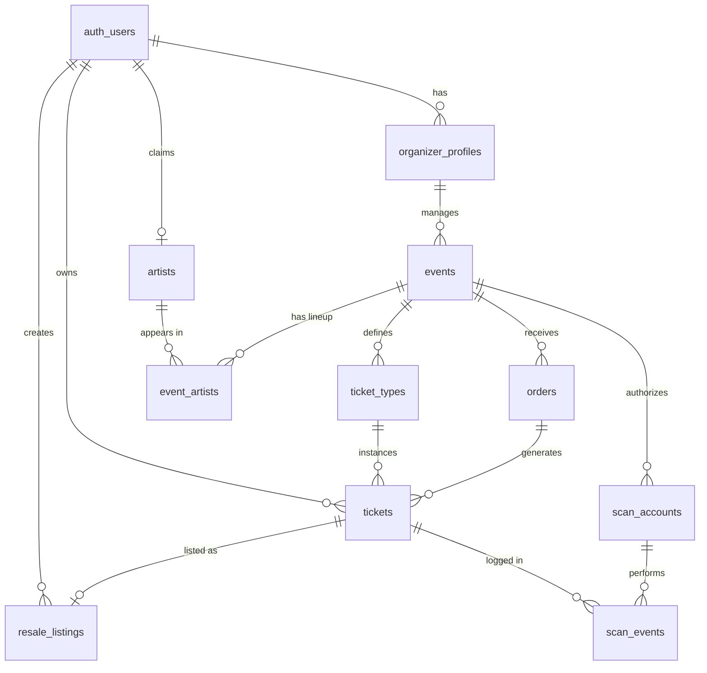

## 5. Technical Reference & Glossary

### 5.1 Domain Glossary
* **Fan:** A standard user `auth.users` who purchases tickets on the primary or secondary market.
* **Organizer:** A user with a linked `organizer_profiles` record. Has permission to create events and mint ticket tiers.
* **Artist:** An officially verified user (via `artist_claims`) representing a performing artist, with direct control over their page data.
* **Ticket Tier:** A pricing class (e.g., "General Admission", "VIP") defined in `ticket_types`. Defines price, capacity, and validity dates.
* **Resale Listing:** A secondary market offering where a fan attempts to sell a previously purchased ticket.
* **Scanner Account:** A non-email entity stored in `scan_accounts` used exclusively to authenticate physical devices running the mobile scanner application at venue doors.
* **AdmitAdmin:** Internal platform employee with customer support and moderation privileges.

### 5.2 Key Frontend Modules
* `platform/src/hooks/useEvent.ts`: Centralizes fetching and mutation logic for Event models, managing the loading states and payload generation.
* `platform/src/hooks/useTicketTiers.ts`: Encapsulates fetching and updating of ticket tiers associated with a specific event.
* `platform/src/features/marketplace/PrimaryTicketSelector.tsx`: Renders the UI logic for determining if an event is external, sold out, or available for primary market purchase.
* `platform/src/components/TicketCard.tsx`: The primary UI representation of a Fan's digital asset. Handles QR code rendering and prevents resale collisions.
* `platform/src/components/ResaleListingCard.tsx`: The primary UI for secondary market discovery.
* `platform/src/features/event-management/ImageUploader.tsx`: Local compression engine saving assets securely to `event_images` buckets.
* `platform/src/components/UpscaledImage.tsx`: Client-side hardware-accelerated upscaling component utilizing off-screen `<canvas>` APIs to restore image fidelity without bandwidth impact.

### 5.3 Database ERD Summary
Below is a high-level representation of the core entity relationships.

---
*(End of Phase 5 - Technical Reference & Glossary)*
